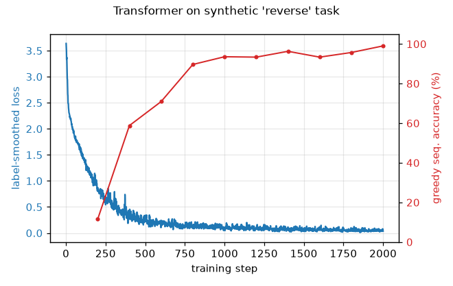
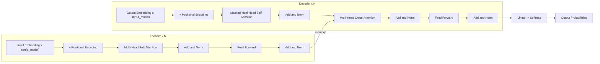

# Transformer from Scratch

A clean, from-scratch PyTorch reimplementation of the Transformer from
**"Attention Is All You Need"** (Vaswani et al., 2017) —
[arXiv:1706.03762](https://arxiv.org/abs/1706.03762).

[](https://github.com/hurjun/attention_is_all_you_need/actions/workflows/ci.yml)

## What this is

This is an **educational, from-scratch reimplementation** of the original
encoder–decoder Transformer — *not* a novel research contribution and *not* a
wrapper around `torch.nn.Transformer`. Every component is built up from
`nn.Linear`/`nn.LayerNorm` primitives: scaled dot-product attention, multi-head
attention, sinusoidal positional encoding, the position-wise feed-forward
network, padding + causal masks, the full encoder/decoder stacks, the Noam
warmup learning-rate schedule, and label-smoothing (KL-divergence) loss. To make
the implementation **demonstrably correct on a laptop**, it is trained to ~98%
exact-match accuracy on a self-contained synthetic sequence task (no data
downloads, a few minutes on CPU). A real EN→DE Multi30k translation path is
included behind a flag for scaling up. Architecture and hyperparameters follow
the paper (Adam β=(0.9, 0.98), ε=1e-9, warmup=4000, label smoothing 0.1), with
`N`/`d_model`/heads fully configurable.

## Results — synthetic `reverse` task (reproducible on CPU)

The model is asked to **reverse** a variable-length sequence of symbols, e.g.
`5 14 6 13 11 15 0` → `0 15 11 13 6 14 5 <eos>`. This requires the model to use
both *content* and *position* correctly, exercising the embeddings, both mask
types, cross-attention and the auto-regressive decode.

A small model (**d_model=128, 4 heads, 2+2 layers, ≈0.66 M params**) trained for
**2000 steps** (batch 64) reaches:

| Metric | Value |
|--------|-------|
| Teacher-forced token accuracy | **0.9981** |
| Greedy free-running exact-match (sequence) accuracy | **0.9824** |
| Final label-smoothed train loss | **0.0507** |
| Wall-clock training time | ~75–90 s on CPU (Apple Silicon, no GPU) |

Numbers are fully reproducible (fixed seeds, deterministic on CPU) by running
the command in [Reproduce the results](#reproduce-the-results).



**Real sample predictions** (held-out, greedy decode; `OK` = exact match):

```
OK  src=1 9 6 5 3 9 11 4
    gold=4 11 9 3 5 6 9 1 <eos>
    pred=4 11 9 3 5 6 9 1 <eos>
OK  src=15 15 12 3 4 5 2 13 6 1
    gold=1 6 13 2 5 4 3 12 15 15 <eos>
    pred=1 6 13 2 5 4 3 12 15 15 <eos>
OK  src=11 12 8 5 14 14 5 14 7 1 4
    gold=4 1 7 14 5 14 14 5 8 12 11 <eos>
    pred=4 1 7 14 5 14 14 5 8 12 11 <eos>
OK  src=15 11 10 14 9 5 3 13 14 8 1
    gold=1 8 14 13 3 5 9 14 10 11 15 <eos>
    pred=1 8 14 13 3 5 9 14 10 11 15 <eos>
OK  src=5 14 6 13 11 15 0
    gold=0 15 11 13 6 14 5 <eos>
    pred=0 15 11 13 6 14 5 <eos>
```

`copy` and `sort` tasks are also provided (`--task copy|sort`).

## Architecture



Component → file map (see [`paper_notes.md`](paper_notes.md) for the
section/equation mapping):

- **Scaled dot-product attention** (paper Eq. 1) — `transformer/attention.py`
- **Multi-head attention** (paper §3.2.2) — `transformer/attention.py`
- **Sinusoidal positional encoding** (paper §3.5, `register_buffer`) — `transformer/positional.py`
- **Position-wise feed-forward** (paper §3.3) — `transformer/feed_forward.py`
- **Encoder layer/stack** (paper §3.1) — `transformer/encoder.py`
- **Decoder layer/stack** (paper §3.1) — `transformer/decoder.py`
- **Padding + causal masks** (paper §3.2.3) — `transformer/masking.py`
- **Full model, embedding scaling, weight tying** (paper §3.4) — `transformer/model.py`
- **Noam LR schedule** (paper Eq. 3) — `transformer/schedule.py`
- **Label-smoothing loss** (paper §5.4) — `transformer/loss.py`

A paper-size base config (`d_model=512, N=6, h=8, d_ff=2048`, shared 37 000-token
vocab, tied embeddings) instantiates to **≈63.1 M parameters** (the paper quotes
≈65 M; the gap is from embedding tying and exact vocab size — see notes below).

## Setup

```bash
git clone https://github.com/hurjun/attention_is_all_you_need.git
cd attention_is_all_you_need
python3 -m venv .venv
source .venv/bin/activate
pip install -r requirements.txt
```

Pinned versions used to produce the results above: Python 3.13, `torch==2.12.1`,
`numpy==2.5.0`, `matplotlib==3.11.0` (CPU; no GPU required).

## Reproduce the results

```bash
# Train the synthetic reverse task and regenerate assets/loss_curve.png
python scripts/train_synthetic.py --task reverse --steps 2000 --device cpu

# Other tasks
python scripts/train_synthetic.py --task copy --steps 1500
python scripts/train_synthetic.py --task sort --steps 3000
```

Run `python scripts/train_synthetic.py --help` for all flags (model size, batch,
warmup, etc.).

## Tests

```bash
pip install pytest ruff
ruff check .
pytest -q
```

The suite (33 tests, ~4 s on CPU) asserts attention output shapes, that the
causal mask is strictly lower-triangular (no future leakage), multi-head
split/merge round-trip correctness, positional-encoding shape/values, the
paper-size parameter count, that a forward pass returns `(B, T, vocab)`, and —
the key correctness signal — an **overfit-one-batch** test proving the model
drives the loss to ~0 and reaches 100% token accuracy on a fixed tiny batch.

## Scaling to real translation (EN→DE, Multi30k)

The exact same model/schedule/loss can be trained on real data via HuggingFace
`datasets` (`torchtext` is deprecated and intentionally avoided):

```bash
pip install -r requirements.txt -r requirements-translation.txt
python scripts/train_translation.py --epochs 20 --batch-size 128
```

> **Honest disclosure:** the translation BLEU below is the **paper's target, not
> a number reproduced on this hardware.** The reproducible result in this repo is
> the synthetic task above. Reaching a competitive BLEU on WMT'14/Multi30k needs
> a GPU and longer training, which were not used here. No BLEU/accuracy numbers
> in this README are fabricated — only the synthetic-task metrics were actually
> measured.

| Task | Metric | Paper (target) | This repo (measured) |
|------|--------|----------------|----------------------|
| WMT'14 EN→DE (base) | BLEU | 27.3 | not reproduced (no GPU) |
| Synthetic reverse | seq. exact-match acc. | — | **0.9824** ✅ |

## Project structure

```
attention_is_all_you_need/
├── transformer/              # the from-scratch model package
│   ├── attention.py          # ScaledDotProductAttention, MultiHeadAttention
│   ├── positional.py         # sinusoidal PositionalEncoding (register_buffer)
│   ├── feed_forward.py       # PositionwiseFeedForward
│   ├── encoder.py            # EncoderLayer, Encoder
│   ├── decoder.py            # DecoderLayer, Decoder
│   ├── masking.py            # padding + causal (look-ahead) masks
│   ├── model.py              # Transformer assembly + greedy_decode
│   ├── schedule.py           # Noam warmup LR schedule
│   ├── loss.py               # label-smoothing KLDiv loss
│   └── config.py             # TransformerConfig dataclass
├── tasks/
│   └── synthetic.py          # copy / reverse / sort data generator
├── scripts/
│   ├── train_synthetic.py    # the reproducible CPU demo
│   └── train_translation.py  # optional EN→DE Multi30k path (flagged)
├── tests/                    # pytest suite (33 tests)
├── assets/loss_curve.png     # generated training curve
├── paper_notes.md            # module → paper section/equation mapping
├── requirements.txt
└── .github/workflows/ci.yml  # ruff + pytest on CPU
```

## Implementation notes / deviations

- **No `nn.Transformer`.** Attention, masking, multi-head split/merge and the
  layer stacks are all implemented directly.
- **Masks are boolean** (`True` = attend); masked logits are set to `-inf` before
  the softmax, with a `nan_to_num` guard for fully-masked rows. This avoids the
  small leakage of a finite `-1e9` additive mask.
- **Embedding scaling & weight tying** follow §3.4: embeddings are scaled by
  `√d_model`, and `tie_embeddings=True` shares the source/target embeddings with
  the output projection.
- **Post-norm by default** (`LayerNorm(x + Sublayer(x))`, as in the paper); a
  **pre-norm** variant is available via `norm_first=True` for deeper/more stable
  training.
- **Parameter count ≈63.1 M** for the base config vs the paper's ≈65 M — the
  difference is embedding tying and the exact vocabulary size, not the layer
  architecture.
- **Tokenizer.** The synthetic task uses integer symbols (no tokenizer). The
  translation script uses simple whitespace tokenization to stay
  dependency-light; the paper uses subword (BPE/word-piece) tokenization.

## References

- Vaswani et al., *Attention Is All You Need*, NeurIPS 2017 —
  [arXiv:1706.03762](https://arxiv.org/abs/1706.03762)
- Rush, *The Annotated Transformer* —
  https://nlp.seas.harvard.edu/annotated-transformer/
- Press & Wolf, *Using the Output Embedding to Improve Language Models*, 2017 —
  [arXiv:1608.05859](https://arxiv.org/abs/1608.05859)

## License

MIT.
